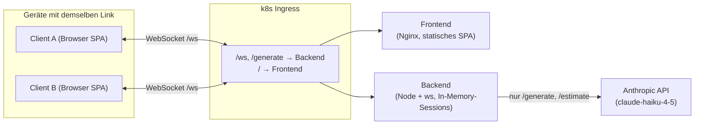
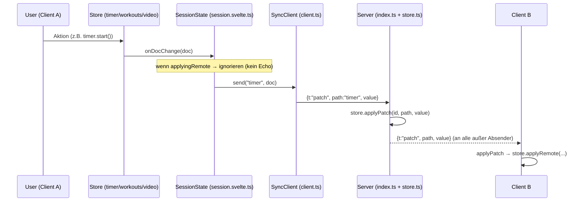
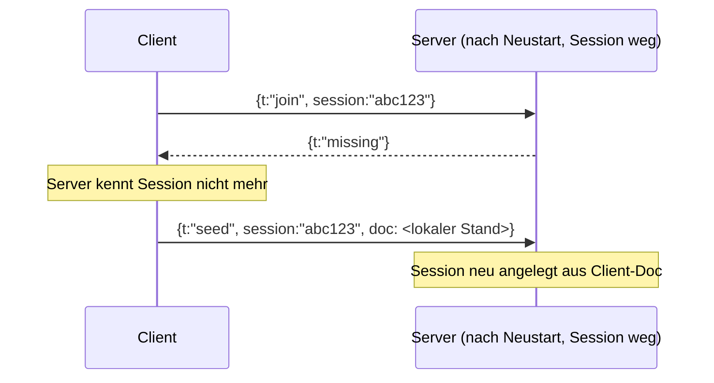

# Onboarding — WODch

Willkommen im WODch-Team! Dieses Dokument bringt dich in den ersten Tagen auf Stand: Was die App macht, wie sie aufgebaut ist, welche Eigenheiten dich überraschen könnten und wo du am besten einsteigst. Verweise gehen immer auf konkrete Dateien — folge ihnen.

> **Kurzfassung:** WODch ist eine Gym-Training-Web-App (Intervall-Timer + Workout-Editor + YouTube-Player in einem anpassbaren Split-Layout) mit **Echtzeit-Session-Sharing per Link — ohne Datenbank und ohne Cloud-Anbieter**. Frontend ist ein Svelte-5-SPA, Backend ein schlanker WebSocket-Sync-Dienst mit In-Memory-Sessions.

---

## 1. Projektüberblick

### Zweck & Domäne

WODch ("WOD" = *Workout of the Day*, CrossFit-Jargon) ist ein Werkzeug fürs Training im Gym. Drei Funktionsblöcke in einem frei anpassbaren Layout:

- **Timer** — 5 Modi: Uhrzeit, Stoppuhr, Count-Down, Count-Up und Intervall mit Presets (Tabata, Fight Gone Bad 1/2, EMOM, 10 Custom-Slots) plus optionalem Warmup.
- **Workout-Editor** — mehrere Tabs mit zentriertem Monospace-Text; umbenennen per Doppelklick, sortieren per Drag & Drop; optional per KI generierbar und mit KI-Dauerschätzung.
- **Video-Player** — YouTube-URL einfügen, ∞-Loop, ±10 s-Buttons.

Das **Alleinstellungsmerkmal** ist das Session-Sharing: Der 📤-Button erzeugt einen Link (`/<id>`). Alle Geräte mit dem Link sehen Timer, Workouts und Video synchron und haben volle Kontrolle (kein Host-Konzept, *last-write-wins*). Sessions verfallen 24 h nach der letzten Änderung.

Vollständige Anforderungen: [docs/rewrite-requirements.md](docs/rewrite-requirements.md). Stack-Entscheidung inkl. Nebenläufigkeit: [docs/rewrite-stack-options.md](docs/rewrite-stack-options.md).

### Sprachen, Frameworks, wichtigste Libraries

| Bereich | Technologie |
|---|---|
| **Frontend** | Svelte 5 (Runes-API: `$state`/`$derived`/`$effect`), Vite 6, TypeScript |
| **Backend** | Node 22, `ws` (WebSocket), `@anthropic-ai/sdk` (KI-Features) |
| **Tests** | Vitest (in beiden Paketen), jsdom fürs Frontend |
| **IDs / QR** | `nanoid` (6-stellige Session-/Tab-IDs), `uqr` (QR-Code im Share-Modal) |
| **Deployment** | Docker (multi-arch), Nginx (Frontend), Kubernetes, GitHub Actions |

Bemerkenswert: **keine State-Management-Library, kein Router, keine UI-Komponenten-Library, keine Datenbank.** Alles läuft über Svelte-5-Runes und handgeschriebene Klassen. Das ist Absicht (siehe Stack-Doku).

### Projektstruktur (Single-Repo, zwei npm-Pakete)

Es ist **kein Monorepo mit Workspace-Tooling** — nur zwei unabhängige npm-Pakete nebeneinander, jedes mit eigenem `package.json` und `node_modules`.

```
frontend/   Svelte-5-SPA, statisches Build hinter Nginx
  src/
    App.svelte              Root-Layout (Split-Panes / Mobile-Tabs, Keyboard, Audio-Cues)
    main.ts                 Einstiegspunkt
    lib/
      components/           Svelte-Komponenten (TimerBar, WorkoutEditor, VideoPlayer, …)
      stores/               Zustand als Klassen-Singletons (timer/workouts/video .svelte.ts)
      timer/                Reine Timer-Logik (engine.ts, format.ts) — keine Svelte-Abhängigkeit
      sync/                 WebSocket-Client, Session-Orchestrierung, Uhr-Sync
      audio/                Ton-Cues (beeps, cues)
      generate/            KI-Client (generate.ts, estimate.ts) → ruft Backend
      video/               YouTube-URL-Parsing + IFrame-API-Typen
      types.ts             Gemeinsame Typen (TimerDoc, WorkoutsDoc, SessionDoc, …)
server/     WebSocket-Sync-Dienst
  src/
    index.ts               HTTP-Server + WebSocketServer, Routing, Nachrichtenschleife
    store.ts               In-Memory-Session-Store + Patch-Anwendung + TTL-Sweep
    generate.ts            /generate: KI-Workout-Generierung (Anthropic)
    estimate.ts            /estimate: KI-Dauerschätzung (Anthropic)
    rateLimit.ts           Gleitendes-Fenster-Rate-Limiter pro IP
    types.ts               Gespiegelte Typen (müssen zu frontend/lib/types.ts passen!)
k8s/        deployment.yaml — Deployments, Services, Ingress
docs/       Anforderungen & Stack-Entscheidungen
```

> ⚠️ **Wichtig:** `server/src/types.ts` und `frontend/src/lib/types.ts` definieren dieselben Wire-Formate (`TimerDoc`, `VideoDoc`, `WorkoutsDoc`, `SessionDoc`) — **getrennt, ohne geteiltes Paket**. Änderst du ein Feld auf einer Seite, musst du die andere von Hand nachziehen, sonst brechen Sync-Patches stumm.

---

## 2. Architektur

### Architekturmuster

- **Frontend:** Grob eine **Layered-Struktur** mit klarer Trennung: reine Logik (`timer/`, `video/`, `generate/`) ↔ reaktiver Zustand (`stores/`) ↔ Sync-Orchestrierung (`sync/`) ↔ UI (`components/`). Reine Logik ist frei von Svelte und dadurch isoliert testbar.
- **Backend:** Ein **einzelner zustandsbehafteter Sync-Dienst**. Kein klassisches Controller/Service/Repository — die HTTP-Routen sind schlanke Handler, `store.ts` ist das einzige „Repository" (In-Memory-Map).
- **Sync-Modell:** **State-Synchronisation per Pfad-Patches** über WebSocket, *last-write-wins*, kein CRDT, kein OT. Bewusst simpel gehalten.

### Systemüberblick



### Zentraler Datenfluss: Session-Sync

Der Kern-Datenfluss ist **nicht** Request→Controller→Service→DB, sondern ein bidirektionaler Patch-Austausch. Lokale Aktion → Store → Session-Layer → WebSocket → Server → Broadcast an andere Clients.



**Zwei Dinge, die dich hier überraschen werden** (siehe §3):

1. Der **laufende Timer wird nie gestreamt.** Übertragen werden nur Zustandsübergänge (`startedAt`, `accumulatedMs`). Jeder Client rechnet die Anzeige lokal aus — siehe [engine.ts](frontend/src/lib/timer/engine.ts), Funktion `deriveInterval`. Das ist deterministisch: gleiche Startzeit + Config → gleiche Phase/Runde auf allen Geräten.
2. **Kein Echo-Loop:** Das `applyingRemote`-Flag in [session.svelte.ts](frontend/src/lib/sync/session.svelte.ts) verhindert, dass ein empfangener Patch sofort wieder rausgeschickt wird.

### Re-Seed: Wie Sessions ohne DB Deploys überleben



Jeder Client hält das **komplette Session-Dokument lokal**. Kennt der Server die Session nach Neustart nicht mehr (`missing`), seedet der erste Client seinen Stand einfach neu. Deshalb braucht es keine Datenbank und keine Persistenz — Sessions überleben Deploys und Pod-Neustarts. Logik: [client.ts:70-74](frontend/src/lib/sync/client.ts#L70-L74) und `seed`-Handling in [index.ts:161-168](server/src/index.ts#L161-L168).

### Uhr-Synchronisation

Da `startedAt` in **Server-Zeit** über das Netz geht, würden Geräte mit falscher Systemuhr auseinanderlaufen. Beim Verbinden misst jeder Client einmal per `ping`/`pong` seinen Versatz zur Server-Uhr (NTP-artig) — [client.ts:77-80](frontend/src/lib/sync/client.ts#L77-L80). Der Versatz landet in [clock.ts](frontend/src/lib/sync/clock.ts); `syncedNow()` und `clockOffset()` korrigieren alle geteilten Zeitstempel.

### Externe Abhängigkeiten

- **Anthropic API** (`@anthropic-ai/sdk`, Modell `claude-haiku-4-5`) — für KI-Workout-Generierung ([generate.ts](server/src/generate.ts)) und KI-Dauerschätzung ([estimate.ts](server/src/estimate.ts)). **Optional:** Fehlt `ANTHROPIC_API_KEY`, degradieren beide Routen sauber mit HTTP 503, die App läuft normal weiter (`hasApiKey()`).
- **YouTube IFrame API** — im [VideoPlayer.svelte](frontend/src/lib/components/VideoPlayer.svelte), Typen in [youtube.d.ts](frontend/src/lib/video/youtube.d.ts).
- Sonst **keine** externen Services — keine DB, kein Redis, kein Auth-Provider.

### Cross-Cutting Concerns

| Concern | Umsetzung |
|---|---|
| **Auth** | **Es gibt keine.** Wer den Link hat, hat volle Kontrolle. Session-IDs sind 6-stellige `nanoid`s (bewusstes Trade-off: kurze teilbare Links vs. Erratbarkeit). |
| **Logging** | Minimal — nur ein Startup-`console.log` im Server. Keine strukturierten Logs. |
| **Error Handling** | Defensiv & still: ungültige WebSocket-Nachrichten werden verworfen ([index.ts:142-146](server/src/index.ts#L142-L146)), `try/catch` um `localStorage`, `clipboard`, JSON-Parsing. KI-Fehler → generische Fehlermeldung, nie Stacktrace an Client. |
| **Config** | Fast keine. `PORT` (Default 8787) und `ANTHROPIC_API_KEY` per Env. Frontend hat gar keine Runtime-Config — WS-URL wird aus `location` abgeleitet ([session.svelte.ts:22-25](frontend/src/lib/sync/session.svelte.ts#L22-L25)). |
| **Rate Limiting** | Nur für KI-Routen: 10 Anfragen/60 s pro IP, gleitendes Fenster ([rateLimit.ts](server/src/rateLimit.ts)). |

---

## 3. Besonderheiten / Konventionen

### Projektspezifische Patterns, die überraschen

1. **Timer wird gerechnet, nicht getickt/gestreamt.** Der Zustand ist minimal (`startedAt`, `accumulatedMs`); Phase, Runde und Anzeige sind **reine Ableitungen** ([engine.ts](frontend/src/lib/timer/engine.ts)). Wer „den Timer synchronisieren" will, sucht vergeblich nach gestreamten Ticks — es gibt sie nicht.

2. **Stores sind Klassen-Singletons mit Runes, keine Svelte-Stores.** Siehe [timer.svelte.ts](frontend/src/lib/stores/timer.svelte.ts): eine `class TimerStore` mit `$state`/`$derived`-Feldern, am Dateiende als Singleton exportiert (`export const timer = new TimerStore()`). Das `.svelte.ts`-Suffix aktiviert die Runes-Kompilierung. **Kein** `writable()`/`readable()`.

3. **Der 10-ms-`setInterval` treibt nur die Anzeige.** [timer.svelte.ts:119-123](frontend/src/lib/stores/timer.svelte.ts#L119-L123) setzt alle 10 ms `timer.now = Date.now()`, damit `$derived`-Werte neu rechnen. Das ist reine UI-Aktualisierung, **kein** Zustandsfortschritt. (Im Test via `import.meta.env.TEST` deaktiviert.)

4. **Der `onDocChange`/`applyingRemote`-Vertrag.** Stores feuern Callbacks (`onDocChange`, `onStructure`, `onTabField`, …) **nur bei lokalen Aktionen**, nie bei `applyRemote*()`. Der Session-Layer setzt beim Anwenden entfernter Patches `applyingRemote = true`. Verletzt du diese Trennung, baust du eine Sync-Endlosschleife. Zentrale Stelle: [session.svelte.ts:58-93](frontend/src/lib/sync/session.svelte.ts#L58-L93).

5. **Feld-granulares, debounced Patchen von Workout-Text.** Tab-Inhalte werden pro Feld (`tab/<id>/content`) mit 500 ms Debounce gepatcht ([session.svelte.ts:70-83](frontend/src/lib/sync/session.svelte.ts#L70-L83)), damit sich parallel Tippende nicht gegenseitig überschreiben. Der Patch-Pfad ist eine kleine DSL — die erlaubten Pfade stehen zentral in [store.ts `applyPatch`](server/src/store.ts#L33-L70) und müssen mit dem Frontend-`applyPatch` übereinstimmen.

6. **Video pausiert immer bei `startedAt`.** Video-Sync funktioniert wie der Timer über `startedAt`/`accumulatedSeconds`, nicht über gestreamte Positionen.

7. **Dünne SDK-Wrapper bewusst nicht unit-getestet.** `generateWorkout`/`estimateDuration` machen echte API-Calls und sind absichtlich testfrei (Kommentar im Code). Getestet wird stattdessen die Handler-Logik (`handleGenerate`/`handleEstimate`) mit injizierten Deps — siehe Dependency-Injection über den `opts`-Parameter von `startServer` ([index.ts:28-38](server/src/index.ts#L28-L38)).

### Namens- & Code-Konventionen

- **`.svelte.ts`** = Modul mit Runes (reaktiv). Reines `.ts` = keine Reaktivität.
- **Kommentare sind auf Deutsch** und erklären *warum*, nicht *was*. Das ist projektweit so — halte dich daran. Auch UI-Texte, Fehlermeldungen und KI-System-Prompts sind auf Deutsch.
- **Wire-Typen enden auf `Doc`** (`TimerDoc`, `SessionDoc`) — das sind die serialisierten Formate über die Leitung.
- **Patch-Pfade** sind flache Strings mit `/`-Segmenten (`timer`, `workouts/activeTab`, `tab/<id>/content`).
- Tests liegen **neben** dem Code (`foo.ts` + `foo.test.ts`), nicht in einem separaten `__tests__`.

### Hidden Knowledge / historisch Gewachsenes

- **Das Projekt ist ein bewusster Rewrite.** Die Grundlage steht in [docs/rewrite-requirements.md](docs/rewrite-requirements.md) und [docs/rewrite-stack-options.md](docs/rewrite-stack-options.md). Lies §6.2 der Stack-Doku, bevor du über Multi-Replica-Backend oder Redis nachdenkst — das ist der geplante (noch nicht gegangene) Ausbaupfad.
- **Legacy-Link-Format:** Alte geteilte Links nutzten `#session=<id>` (Hash), neue nutzen `/<id>` (Pfad). [session.svelte.ts `joinFromLocation`](frontend/src/lib/sync/session.svelte.ts#L170-L177) normalisiert Legacy-Hash-Links per `history.replaceState` auf die Pfadform. Nicht wegrationalisieren.
- **Der `.superpowers/`-Ordner** enthält KI-Workflow-Artefakte (Task-Briefs, Review-Diffs) aus der Entwicklung, kein Produktivcode.

### Lokaler Setup / Build / Test

```bash
# Terminal 1 — Sync-Dienst (Port 8787)
cd server && npm install && npm run dev      # tsx watch

# Terminal 2 — Frontend (Port 5173, proxied /ws & /generate → 8787)
cd frontend && npm install && npm run dev    # vite
```

Der Vite-Dev-Server proxied `/ws` und `/generate` auf `localhost:8787` ([vite.config.ts](frontend/vite.config.ts)). Für KI-Features brauchst du `ANTHROPIC_API_KEY` in der Server-Umgebung — ohne ihn liefern die Routen 503, der Rest läuft.

Tests (in **beiden** Paketen separat):

```bash
npm test            # einmalig (Vitest)
npm run test:watch  # Watch-Mode
```

Frontend-`build` läuft `svelte-check` (Typprüfung) **vor** `vite build` — Typfehler brechen den Build. Der CI-Test-Job (beide Pakete: `npm test` + `npm run build`) muss vor jedem Image-Build grün sein ([.github/workflows/docker.yml](.github/workflows/docker.yml)).

---

## 4. Schwächen / Technische Schulden

> Kein Alarm — die Codebasis ist klein (~2.400 Zeilen Komponenten) und sauber. Aber diese Stellen solltest du kennen, bevor du dort anfasst.

### ⚠️ Akuter Stolperstein: `/estimate` fehlt im Ingress

Der aktuelle Branch `feat/workout-dauer-schaetzung` fügt die Route **`/estimate`** hinzu ([index.ts:86-125](server/src/index.ts#L86-L125)). Der k8s-Ingress in [k8s/deployment.yaml](k8s/deployment.yaml) routet aber nur `/ws` und `/generate` aufs Backend — **`/estimate` ist nicht eingetragen**. In Produktion fällt `/estimate` damit auf `/` (Frontend-Nginx) und liefert `index.html` statt JSON → die Dauerschätzung schlägt fehl. **Vor dem Merge muss `/estimate` als Ingress-Pfad ergänzt werden** (analog zu `/generate`, an beiden Hosts). Prüfe das als Erstes.

### Host-Namen (historischer Hinweis)

Produktions-Host ist `wodch.com` / `www.wodch.com` (bewusst gesetzt in Commit `5084dda`). Ältere Planungsdokumente unter [docs/](docs/) nennen noch den früheren Cluster-Host `wodch.g11s.cc` — das ist historischer Stand, nicht der aktive Ingress. Maßgeblich ist [k8s/deployment.yaml](k8s/deployment.yaml).

### Kopplung & Verantwortlichkeiten

- **`server/src/store.ts` `applyPatch` ↔ `frontend/.../session.svelte.ts` `applyPatch`** kennen dieselbe Pfad-DSL doppelt. Neue Sync-Felder müssen an **drei** Stellen konsistent sein: beide `applyPatch` + die `types.ts` beider Seiten. Es gibt keinen Compiler, der das erzwingt → hohe Gefahr stummer Fehler.
- **`session.svelte.ts` (SessionState)** ist die zentrale Orchestrierungs-Klasse und kennt alle drei Stores plus den Client. Das ist der komplexeste Teil des Frontends und die wahrscheinlichste Stelle für Sync-Bugs (Echo-Loops, verpasste `applyingRemote`-Guards). Vorsichtig ändern, immer mit Tests.

### God-Class-Kandidat

- **[WorkoutEditor.svelte](frontend/src/lib/components/WorkoutEditor.svelte) (577 Zeilen)** ist mit Abstand die größte Komponente: Tab-Verwaltung, Drag & Drop, Doppelklick-Umbenennen, KI-Generierung, Dauerschätzung-Popover, Textbearbeitung — alles in einer Datei. Beim Einstieg meiden oder nur punktuell anfassen; ein Refactoring-Split wäre eigenständige Arbeit. [TimerModal.svelte](frontend/src/lib/components/TimerModal.svelte) (369 Zeilen) ist der zweitgrößte Brocken.

### Testabdeckung

Solide bei reiner Logik (Timer-Engine, Store-Klassen, Sync-Client, Server-Handler — 23 Frontend- + 7 Server-Test-Dateien). **Dünn bei UI-Komponenten:** ohne Test sind u. a. **[TimerBar.svelte](frontend/src/lib/components/TimerBar.svelte)**, **[TimerModal.svelte](frontend/src/lib/components/TimerModal.svelte)**, **[VideoPlayer.svelte](frontend/src/lib/components/VideoPlayer.svelte)** und **[ShareButton.svelte](frontend/src/lib/components/ShareButton.svelte)**. Die dünnen SDK-Wrapper (`generateWorkout`/`estimateDuration`) sind bewusst untestet (echte API-Calls).

### Risiken für neue Entwickler

- **Sync-Endlosschleifen** durch verletzten `applyingRemote`-Vertrag — die Nr.-1-Falle.
- **Wire-Format-Drift** zwischen `server/types.ts` und `frontend/types.ts`: bricht stumm, kein Fehler beim Kompilieren.
- **Keine Auth:** jede Änderung am Sharing hat Sicherheits-/Privacy-Implikationen (jeder mit Link hat Vollzugriff — by design, aber sei dir dessen bewusst).
- **Skalierung:** Der Sync-Dienst ist absichtlich **eine Replica** (`replicas: 1`, `strategy: Recreate`), weil Sessions im RAM liegen. Setze das nicht naiv hoch — mehrere Replicas brauchen den Redis-Ausbaupfad aus der Stack-Doku §6.2.

---

## 5. Empfehlungen für den Einstieg

### Lies zuerst (in dieser Reihenfolge)

1. [README.md](README.md) — Feature- und Deployment-Überblick.
2. [frontend/src/lib/types.ts](frontend/src/lib/types.ts) & [server/src/types.ts](server/src/types.ts) — die gemeinsamen Datenmodelle. Alles dreht sich um diese Formate.
3. [frontend/src/lib/timer/engine.ts](frontend/src/lib/timer/engine.ts) — reine, gut testbare Kernlogik. Verstehe hier das „Timer wird abgeleitet, nicht getickt"-Prinzip. Dazu [engine.test.ts](frontend/src/lib/timer/engine.test.ts).
4. [frontend/src/lib/stores/timer.svelte.ts](frontend/src/lib/stores/timer.svelte.ts) — das Runes-Store-Muster in Reinform.
5. [frontend/src/lib/sync/session.svelte.ts](frontend/src/lib/sync/session.svelte.ts) + [client.ts](frontend/src/lib/sync/client.ts) — das Sync-Herz. Der schwierigste, aber wichtigste Teil.
6. [server/src/index.ts](server/src/index.ts) + [store.ts](server/src/store.ts) — die Gegenseite. Klein und in einem Rutsch lesbar.

### Sinnvoller erster Task

Am besten etwas, das dich durch **einen kompletten Sync-Pfad** führt, ohne die riskante `WorkoutEditor`-Komponente:

- **Idealer Einstieg (und ohnehin nötig): `/estimate` im Ingress ergänzen** (§4). Kleiner, klar umrissener Fix, der dich zwingt, den Weg Frontend-Client → Route → Handler → Anthropic → Ingress nachzuvollziehen. Danach die Route auch lokal über den Vite-Proxy testen (Proxy-Eintrag für `/estimate` in [vite.config.ts](frontend/vite.config.ts) fehlt derzeit ebenfalls — es ist nur `/ws` und `/generate` eingetragen).
- **Alternativ zum Warmwerden:** einen Charakterisierungs-Test für eine bisher untestete Komponente schreiben (z. B. [ShareButton.svelte](frontend/src/lib/components/ShareButton.svelte) — klein und überschaubar). Zeigt dir das Test-Setup (jsdom, `test-setup.ts`) und Svelte-5-Komponententests.

### Faustregeln

- Neues Sync-Feld? → `types.ts` (beide), `store.ts applyPatch`, `session.svelte.ts applyPatch` **und** einen Store-Callback. Immer mit Test.
- Reaktivität kaputt? → Prüfe, ob die Datei `.svelte.ts` heißt und `$state`/`$derived` nutzt.
- Nichts wird synchronisiert / Endlosschleife? → `applyingRemote` und die `onDocChange`-Kette prüfen.
- Frag im Zweifel die Stack-Doku, bevor du Architektur änderst — vieles Simple ist bewusst simpel.
