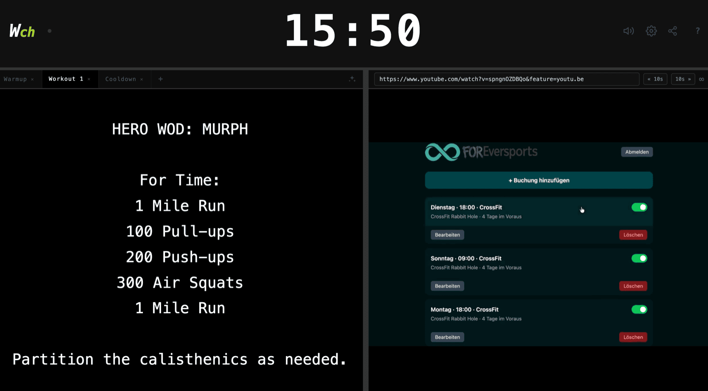

# WODch

Gym-Training-Web-App: vollwertiger Intervall-Timer, Multi-Tab-Workout-Editor und YouTube-Player in einem frei anpassbaren Split-Layout — mit Echtzeit-Session-Sharing per Link, ganz ohne Cloud-Anbieter.



## Features

- **Timer** — 5 Modi: Uhrzeit (12h/24h), Stoppuhr (1/100s), Count-Down, Count-Up, Intervall mit Presets (Tabata, Fight Gone Bad 1/2, EMOM, 10 Custom-Slots) und optionalem Warmup. Phase und Runde werden deterministisch aus Startzeitpunkt + Konfiguration abgeleitet.
- **Workout-Editor** — mehrere Tabs (umbenennen per Doppelklick, sortieren per Drag & Drop), zentrierter Monospace-Text.
- **Video-Player** — YouTube-URL einfügen (`watch?v=`/`youtu.be`), ∞-Loop, ±10s-Buttons.
- **Session-Sharing** — 📤-Button erzeugt einen Link (`#session=<id>`). Alle Geräte mit dem Link sehen Timer, Workouts und Video synchron und haben volle Kontrolle (kein Host-Konzept, last-write-wins). Sessions verfallen 24 h nach der letzten Änderung.
- **Bedienung** — Klick auf die Timer-Leiste: Start/Pause (im Idle: Einstellungen). Tastatur: `Space` Start/Pause, `R` Reset, `M` Einstellungen. Beim ersten Besuch führt eine kurze Tour durch die Funktionen — jederzeit neu startbar über den ?-Button in der Timer-Leiste.

## Architektur

```
frontend/   Svelte 5 + Vite + TypeScript, statisches SPA-Build hinter Nginx
server/     Sync-Dienst: Node 22 + ws, Sessions in-Memory, 24h-TTL-Sweep
k8s/        Deployments (frontend skalierbar, sync replicas: 1) + Ingress
```

**Sync-Modell:** Clients verbinden sich per WebSocket (`/ws`) und tauschen Pfad-Patches aus (`timer`, `video`, `videoUrl`, `workouts`, `workouts/activeTab`, `tab/<id>/content|title`). Der laufende Timer wird **nie** gestreamt — übertragen werden nur Zustandsübergänge (`startedAt`, `accumulatedMs`); jeder Client rechnet die Anzeige lokal. Workout-Eingaben werden 500 ms debounced und pro Tab-Feld gepatcht, damit sich parallel Tippende nicht überschreiben.

**Re-Seed:** Jeder Client hält das komplette Session-Dokument lokal. Kennt der Server die Session nach einem Neustart nicht mehr (`missing`), seedet der Client seinen Stand einfach neu — Sessions überleben so Deploys und Pod-Neustarts ohne Datenbank.

## Entwicklung

```bash
# Terminal 1 — Sync-Dienst (Port 8787)
cd server && npm install && npm run dev

# Terminal 2 — Frontend (Port 5173, proxied /ws → 8787)
cd frontend && npm install && npm run dev
```

Tests (Vitest, in beiden Paketen):

```bash
npm test           # einmalig
npm run test:watch # Watch-Mode
```

## Deployment

Zwei Container-Images, gebaut per GitHub Actions bei Push auf `main` (Tag `latest`) und Git-Tags `vX.Y.Z` (Tag `X.Y.Z`), multi-arch (amd64 + arm64), Registry `ghcr.io`:

| Image | Inhalt | Port |
|---|---|---|
| `ghcr.io/gerrited/wodch-frontend` | Statisches Build hinter Nginx | 80 |
| `ghcr.io/gerrited/wodch-backend` | WebSocket-Sync-Dienst + AI-Generierung | 8787 |

Der Test-Job (beide Pakete: `npm test` + Build) muss vor dem Image-Build bestehen.

Lokal bauen:

```bash
docker build -t wodch-frontend:local ./frontend
docker build -t wodch-backend:local ./server
```

### Kubernetes

`k8s/deployment.yaml`: Frontend-Deployment + Service, Sync-Deployment (`replicas: 1`, `strategy: Recreate`, `/healthz`-Probes) + Service, ein Ingress (`wodch.com` / `www.wodch.com`) mit `/ws`, `/generate`, `/estimate` → Backend und `/` → Frontend (WebSocket-Timeouts via Annotations).

Der Sync-Dienst hält Sessions im Arbeitsspeicher — bewusst eine Replica. Ausbaupfad für mehrere Replicas (Redis als Backing Store + Pub/Sub): siehe [docs/rewrite-stack-options.md](docs/rewrite-stack-options.md), Abschnitt 6.2.

## Docs

- [docs/rewrite-requirements.md](docs/rewrite-requirements.md) — vollständige Anforderungen (Grundlage des Rewrites)
- [docs/rewrite-stack-options.md](docs/rewrite-stack-options.md) — Stack-Entscheidung inkl. Nebenläufigkeit & State-Haltung
